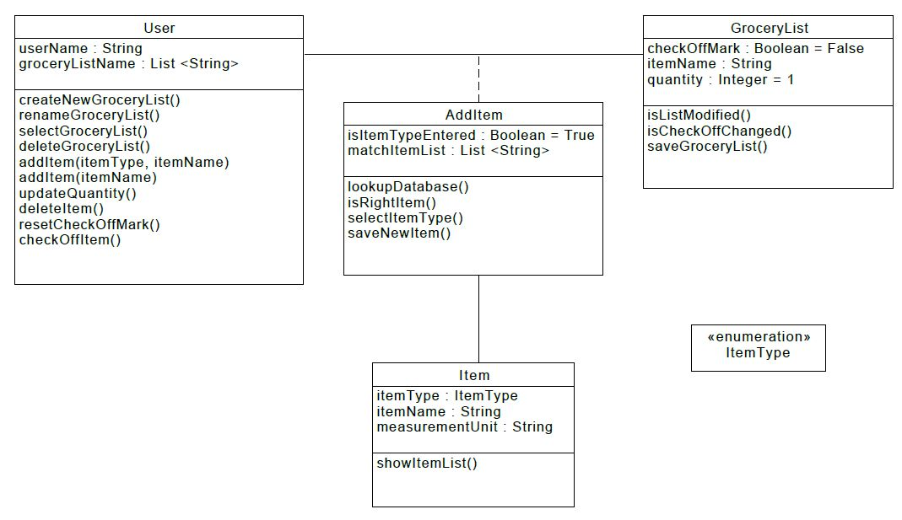
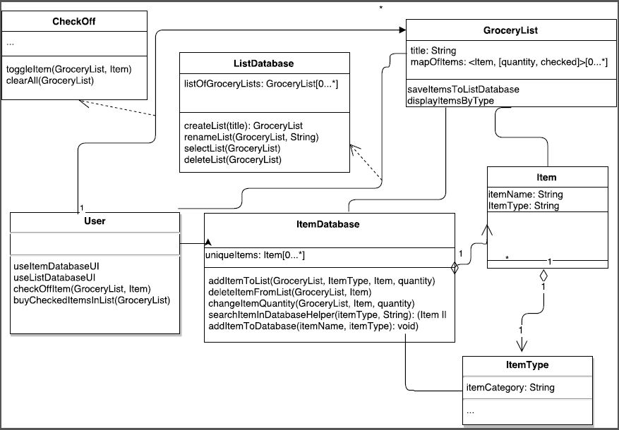
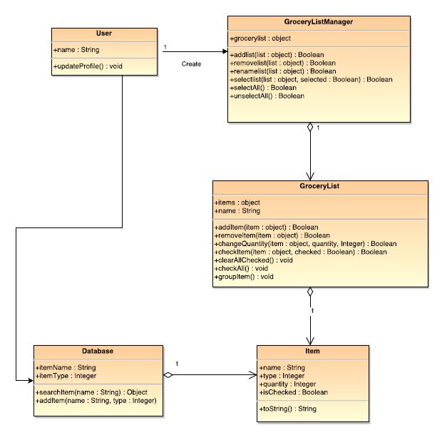
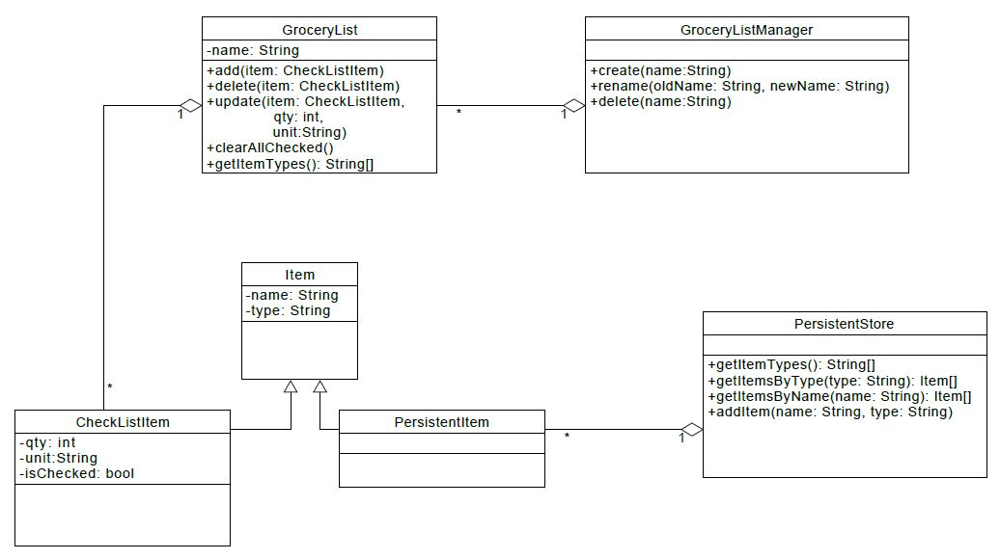

#Individual Design

##Design1  by Osarugue Egharevba

Pros:

1. It is clear and easy to understand

Cons:

1. The relationship between the classes are not properly represented.

2. The bulk of the operations are on the User class which would make implementation harder.

3. Visibility is not modelled.

4. Return type and parameter type is also not modelled.

##Design2  by Thien Van

Pros:

1. Divided discrete actions into their own classes: manipulating Lists, Items, checking off items.

2. Stronger implication of automatically saving after each action taken (association with each action class).

Cons:

1. Focused too much on implementation details such as datastructures, interface.

2. Not enough abstraction of operations into their own distinct classes such as unnecessary User class.

3. Missed a key detail: unit attribute for item.

4. General relationships are not very clear.

##Design 3 by Daniel cai

Pros:

1. All the attributes and operations have return type.

2. Has good abstraction of classes.

Cons:

1. The user class is not needed.

2. The association relationship and inheritance relationship is not very clear in the UML.

3. Need to add getItemsByType operation in database class. 

##Design 4 by Gopal Ramanujam

Pros:

1. Classes and its operation are self contained.

2. Associations are well defined.

Cons:

1. Some namings are not very clear.

2. Missed some operations on GroceryList to check or checkall an item.

# Team Design

##Design 1 

Commonalities:

1. Has a GroceryList  and an Item class.

2. Some operations and parameters are similar.

Differences:

1. The relationship used between the classes are different.

2. The User class is replaced by the GroceryManager class.

3. The bulk of the operations are split between the GroceryList and GroceryManager class.

4. DatabaseStore class is created.

##Design 2 

Commonalities:

1. Ways to represent Item class.

2. ItemDatabase type class.

Differences:

1. Modeling from a loose graph to a more strict hierarchy.

2. Modeling a style of 1 step modifications of each action (toggle, ListsManager, ItemManager) to having each action be dependent on a higher class.

3. Modeling with actions in their own classes to moving those actions into Class operations.

##Design 3 

Commonalities:

1. Has database class and most operations.

Differences:

1. The user class is not necessary.

2. Does not have item unit attribute. 

3. Some of the relatinship types are not complete.

##Design 4 

Commonalities:

1. The associations are the same.

2. The modeled classes are the same.

Differences:

1. Modeling the CheckListItem initially by checking separately compared to embedding as part of Grocery List.

# Summary

1. Group dicussion is able to come up with more ideas, thus make a better design. Everyone brings an unique perspective to a problem

2. The relationship between classes became clearer.

3. How to model with an eye on the implementation.

4. Target more towards high level abstraction; no implementation details.

5. Has-a relationships remove the need to include the class as an attribute (removes redundancy).

6. Trade-off between representation of action by the user to moving those actions into their own classes.

7. Discussion and critiquing a design brings out more question and answers.

