# GroceryShoppingListApp

This is the repository grocery shopping list android application. It is Georgia Tech CS6300 Software Development Process group project. 
Below is the design document. 

# Design Document

## 1 Design Considerations

### 1.1 Assumptions

We assume the user is able to download and install the apk and the mobile device has minimum 100 MB storage.

### 1.2 Constraints

The app does not support sharing the grocery list data with other mobile devices. 

### 1.3 System Environment

The application is running on Android, and the minimal Android system version required is Android 4.4 (KITKAT).

## 2 Architectural Design

*The architecture provides the high-level design view of a system and provides a basis for more detailed design work. These subsections describe the top-level components of the system you are building and their relationships.*

### 2.1 Component Diagram

The GroceryListManager provides an interface for manipulating the GroceryList.

The GroceryList provides an interface for the selection of items, as well as performing other operations on the item component.
 
The GroceryList requires persistence. 
 
The Item component provides an interface for the database. 
 
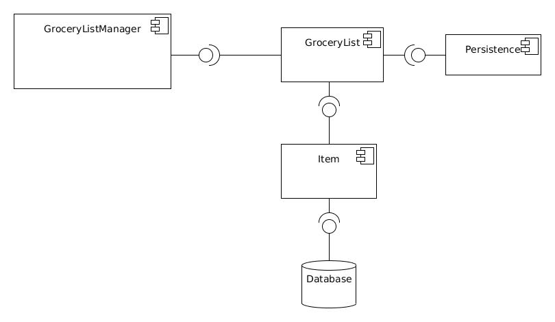

### 2.2 Deployment Diagram

The deployment diagram for this app is pretty simple since everything takes place within the same hardware element.

The android app would run inside an android device and android handles its own database.

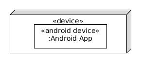

## 3 Low-Level Design

### 3.1 Class Diagram

## 4 User Interface Design

This section talks about the User Interface design and its interaction. This is not giving the Visual specification but more of a Interaction Specification. 

User can launch the application by double clicking the application icon from their android desktop.

Once it launches it first lands in to the Grocery List Page where user can do Management of their Grocery List.

 

User can Create a New Grocery List, Edit or Delete the Grocery List. User can click on a Menu with a ... on the right to get the list of menu items.

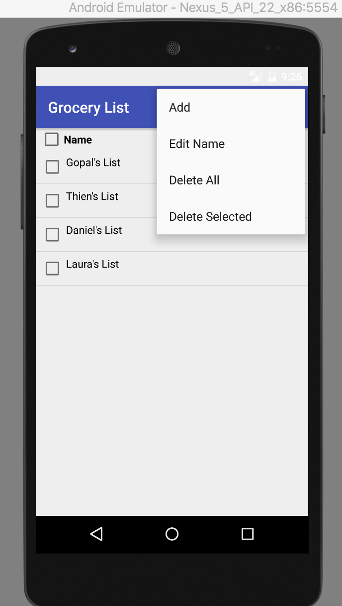 

User can select the list and delete one or all the list using the menu. 

They can also click on the Edit to rename the List Name. 

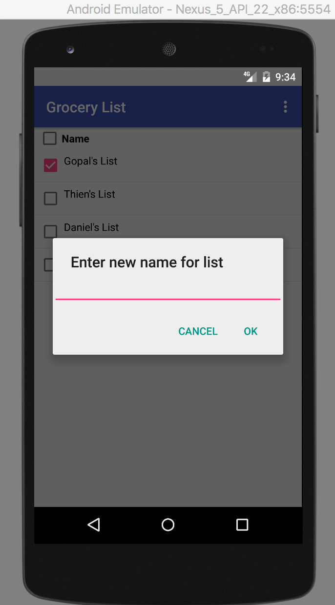 

When a Add menu  is clicked it will allow users to create a new list.

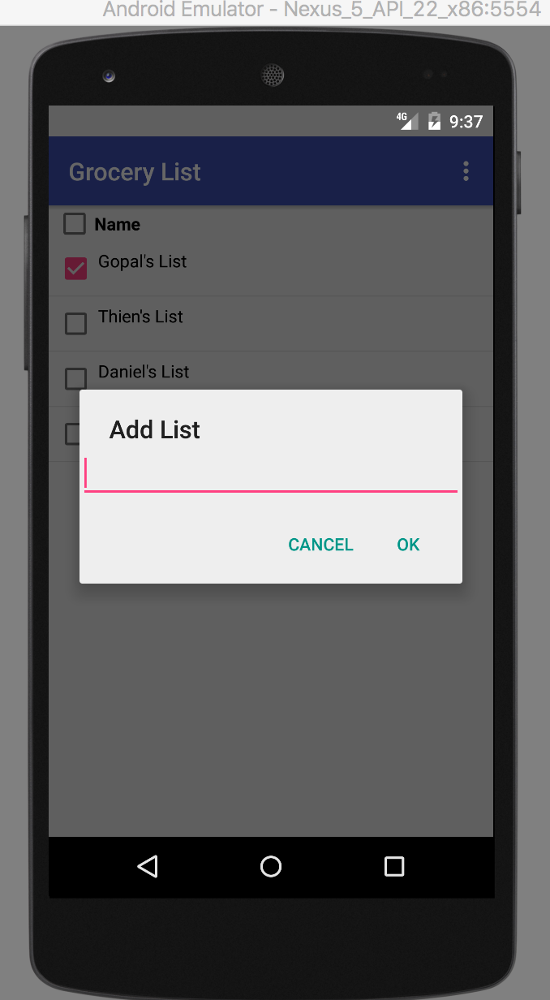 

Here user can enter the name of the new List and click on OK to add the list to the existing List. 

Clicking on the Grocery List will take them to the GroceryDetailListPage where it shows the Details of the Grocery List.

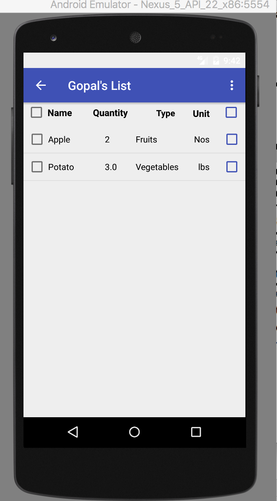 

From here user can do several operation like Deleting the items in the list,  checking the item in the list or change the quantity of item in this list. There is also provision for the user to do checkAll or uncheckAll by selecting the header on the table.

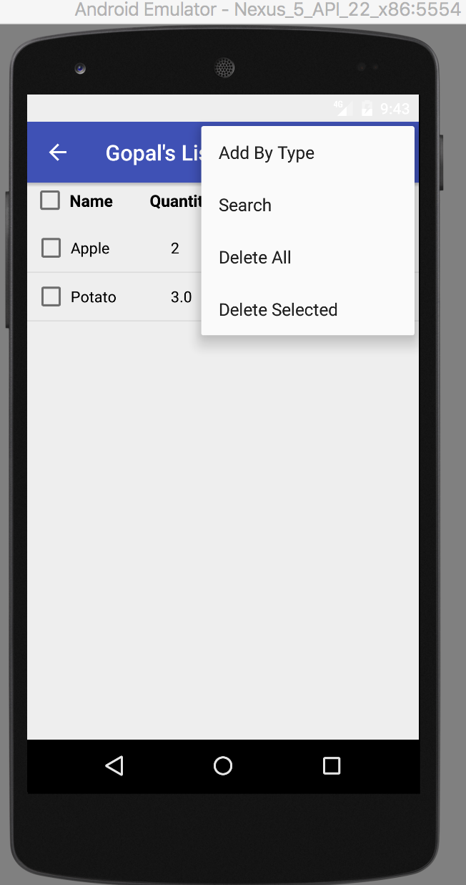 

User will click on Add By Type to Add an item to the list. 

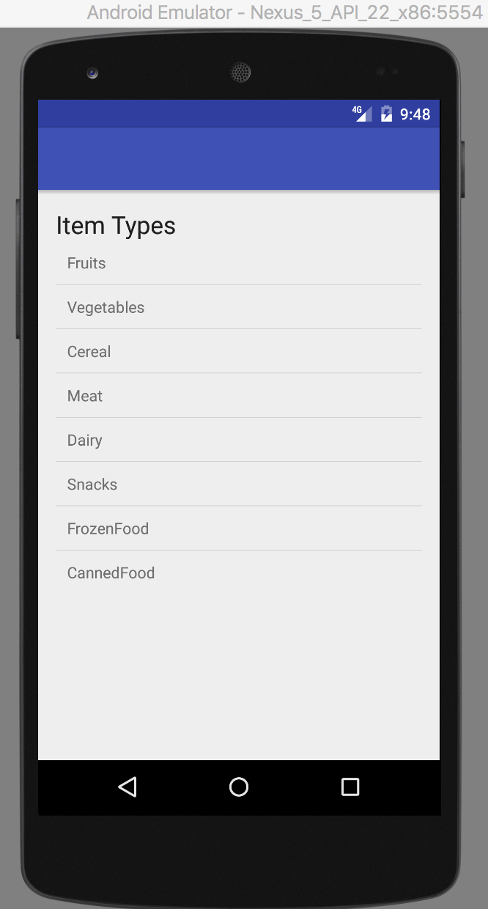 

In this page user can either Select the type of the item they add.

Once User selects the types then it will lead the user to the page to Select the name that is there in the database.

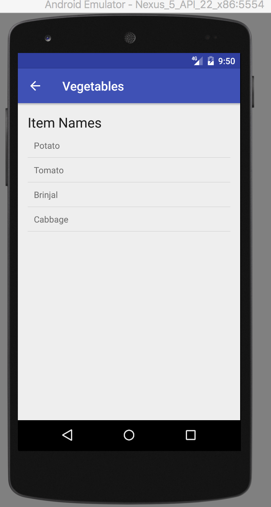 

User can select the item from this page and input the qantity to add the item to the Grocery List and user will be navigated back to the *GroceryDetailListPage*. 

If user searches for a item from the * *GroceryDetailListPage* then it will launch a page which have the ability to search.

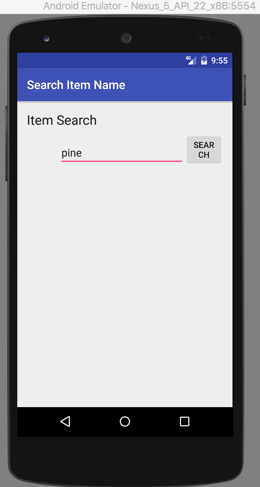 

This page shows the matching list. Users can select the list that can be added to the GroceryList.

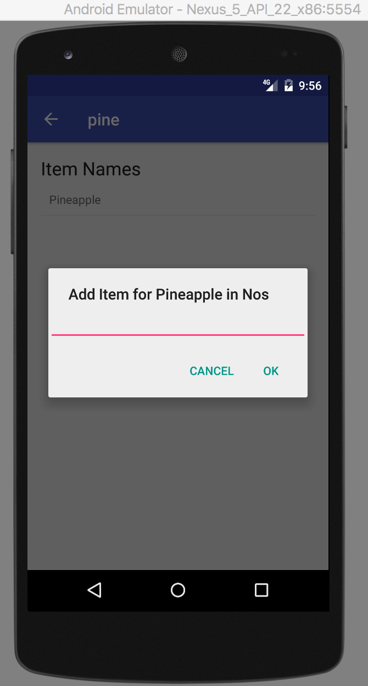 

If the item is not found it will go to AddNewItemPage.
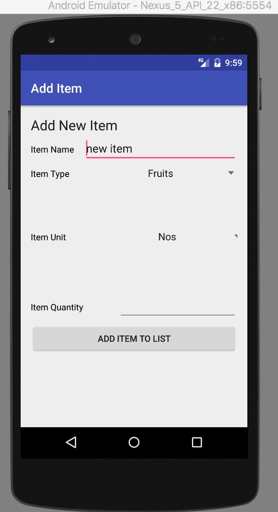 

Once the new Item page is clicked then it will have a option to select the type and once the type is selected it will navigate the screen back the the *GroceryDetailListPage* and will also add the new item to the Persistent Datastore.

